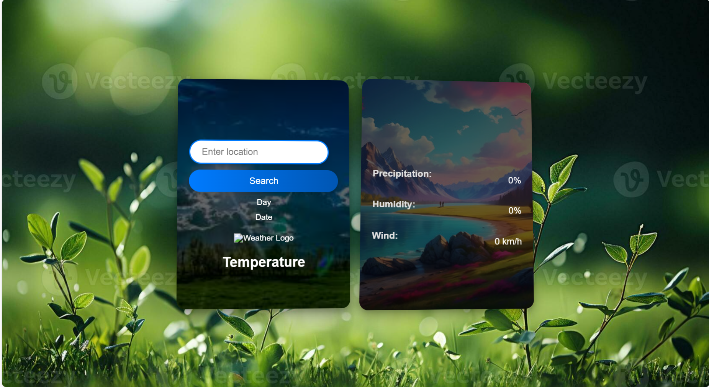

Features
Location-Based Weather Data: Fetch current weather details by entering a location.
Dynamic Weather Icons: Different icons are displayed based on temperature values.
Responsive Design: Ensures compatibility across various devices and screen sizes.
Stylish UI: 3D-looking cards and a sleek search bar.

Screenshots:

Main Page

Weather Cards Layout
Card 1: Displays the current weather including temperature, weather condition, and an icon.
Card 2: Provides additional details such as precipitation, humidity, and wind speed.

